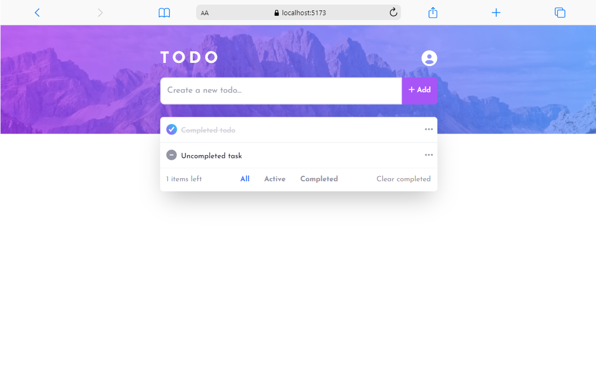
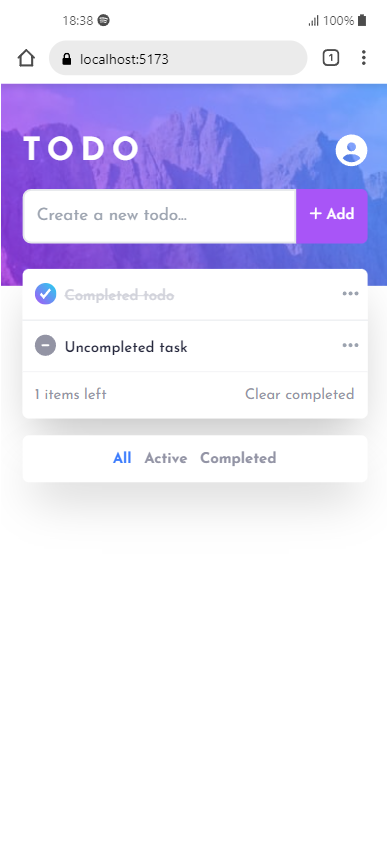
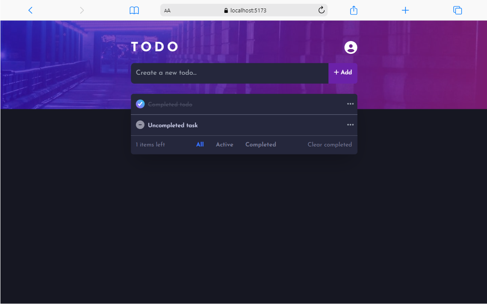
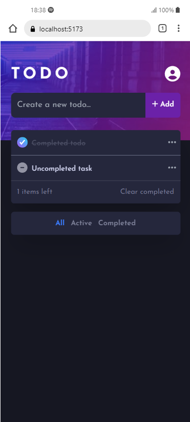

# Todo App

## Description

Todo App is a full-stack application that helps users manage their tasks. The
application includes a backend built with ASP.NET Core and a frontend based on a
design challenge from Frontend Mentor. Users can add, edit, delete, and mark
tasks as complete.

## Features

-   Add new tasks
-   Edit existing tasks
-   Delete tasks
-   Mark tasks as complete
-   Responsive design based on the Frontend Mentor challenge

## Technologies Used

-   ASP.NET Core
-   Entity Framework Core
-   MySQL
-   Swagger for API documentation
-   React
-   Tailwind CSS

## Prerequisites

-   .NET 6.0 SDK or higher
-   Node.js and npm
-   MySql (local or cloud)

## Screenshots

## Contributions

Contributions are welcome. Please open an issue or submit a pull request.

## License

This project is licensed under the MIT License.

## Acknowledgements

This project is based on the
[TodoApp challenge](https://www.frontendmentor.io/challenges/todo-app-Su1_KokOW)
from Frontend Mentor.
